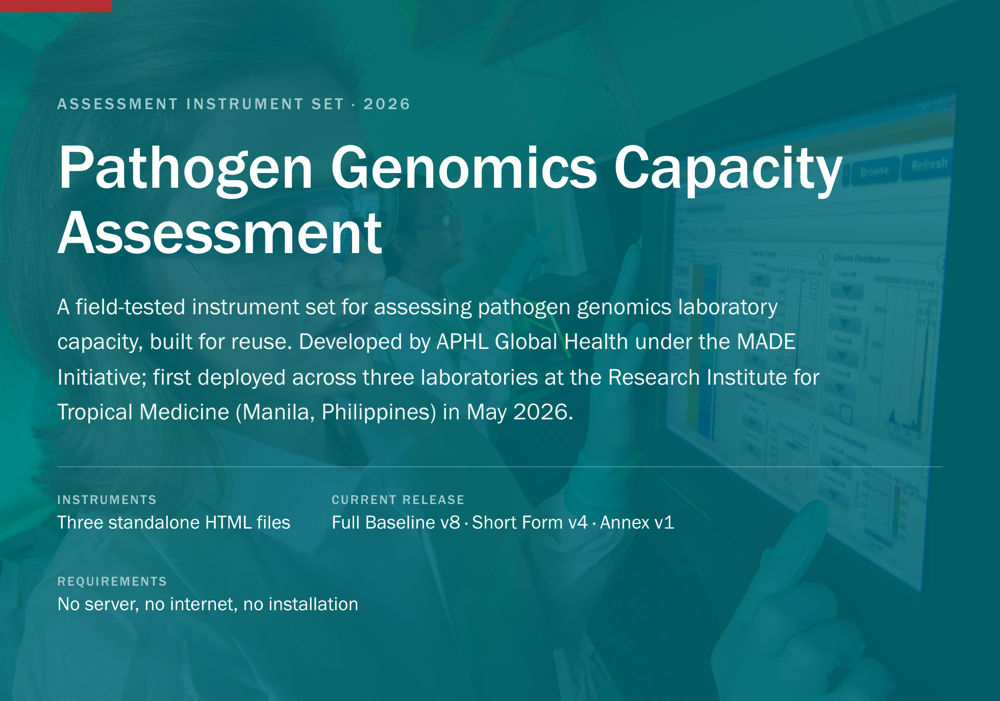
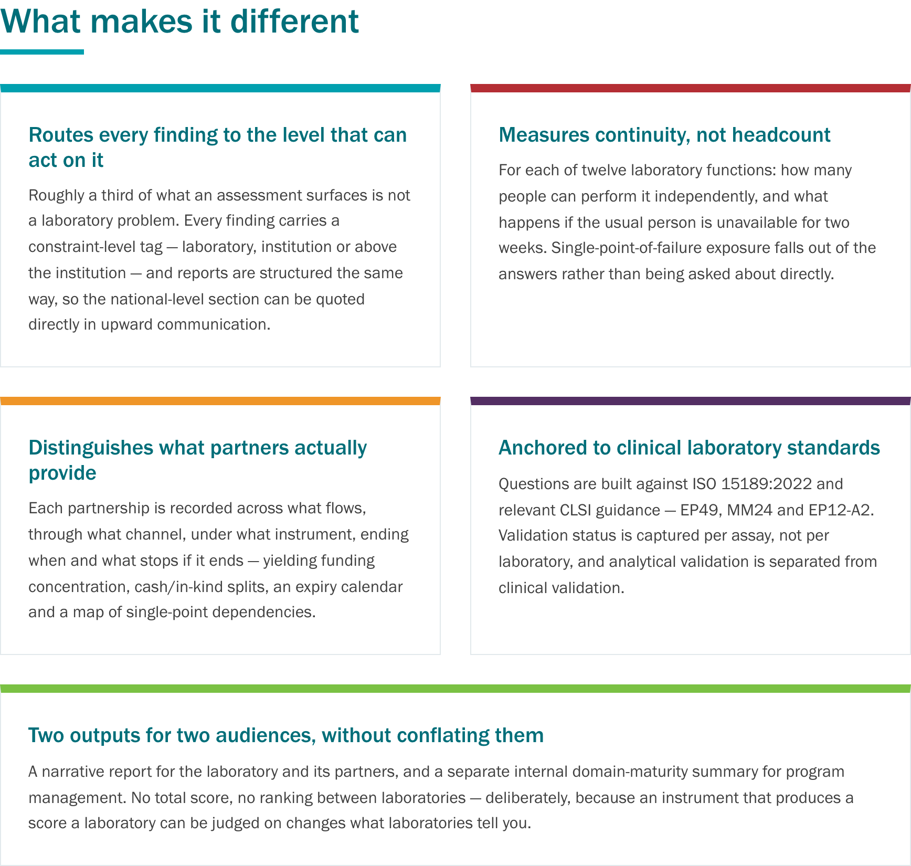
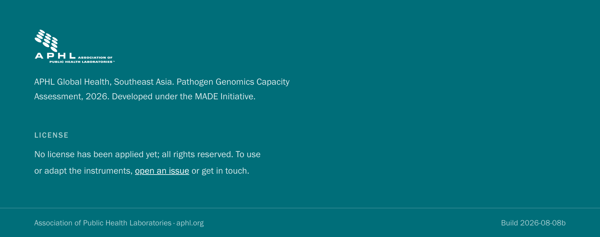

<br>

## What this is

A structured assessment system for pathogen genomics (NGS) laboratory capacity, delivered as three self-contained HTML instruments. Each runs in any modern browser — including on a tablet at the bench — auto-saves locally as you type and exports structured data.

| Instrument | Version | When it's used | Respondent | Time |
|---|---|---|---|---|
| [**Short Form**](instruments/NGS_Assessment_Short_Form_-_APHL_v4.1__standalone_.html) | v4.1 | Sent 2–3 weeks ahead of a visit, to scope it | One senior respondent per laboratory | ~30 min |
| [**Full Baseline**](instruments/NGS_Assessment_Full_Baseline_-_APHL_v8.1__standalone_.html) | v8.1 | On site, over 1–2 days | Laboratory team, with assessor | 1–2 days |
| [**Enabling Environment Annex**](instruments/NGS_Assessment_Leadership_Annex_-_APHL_v1.1__standalone_.html) | v1.1 | Once per site, with institutional leadership | Leadership (ministry participation where possible) | Half day |

## Getting started

1. Download the instrument you need from [`instruments/`](instruments/) — open the file, then use **Download raw file**, or grab everything via **Code → Download ZIP**.
2. Open the file in a browser. It works fully offline.
3. Use **Load demo data** to populate an illustrative composite laboratory — built for assessor training and demonstration. It is not any real laboratory.
4. Responses persist in the browser between sessions. The **Assessment Summary** view (toolbar) and the text export are available at any point.

> Each instrument carries a build stamp — in the page footer, in the hero panel and on `window.__BUILD` in the browser console. Current builds are Full Baseline v8.1, Short Form v4.1 and Enabling Environment Annex v1.1, all build **2026-08-08b**. If you report a problem, start by identifying which build was open.

## What makes it different



## The maturity scale

A five-level scale is applied to a defined subset of questions (physical facts, counts and dates stay binary or numeric):

| Level | Meaning |
|---|---|
| 0 | Not present and not currently planned |
| 1 | Decision taken, work underway, not yet usable |
| 2 | Working in practice but not documented, or documented but not in routine use |
| 3 | Documented and in routine use |
| 4 | As level 3, plus evidence of effectiveness from audit, EQA, competency or monitoring data |

The laboratory self-rates eight domains; the assessor rates the same eight independently. Both are kept, and the divergence is computed and displayed — a gap is information, not an error.

## Why it transfers

Nothing in the laboratory instruments is country-specific. Application modules select automatically based on the sequencing work a laboratory actually performs, so the same instrument serves a viral surveillance laboratory, a bacterial AMR reference laboratory and a laboratory in its first year of build-out. Country-specific policy context lives in the Enabling Environment Annex — the laboratory instrument stays constant (findings comparable across countries) while the annex absorbs the regulatory, procurement and employment contexts that differ everywhere.

A new country deployment requires: assessor familiarization (about half a day), 2–3 days on site for a three-laboratory site, access to institutional leadership for the annex, and local adaptation limited to the annex and regulatory references.

## Repository contents

```
instruments/
  NGS_Assessment_Short_Form_-_APHL_v4.1__standalone_.html      Pre-visit scoping form
  NGS_Assessment_Full_Baseline_-_APHL_v8.1__standalone_.html   On-site baseline assessment
  NGS_Assessment_Leadership_Annex_-_APHL_v1.1__standalone_.html Enabling environment annex
docs/
  pathogen-genomics-assessment-brief.md / .pdf                 Two-page overview of the system
  release-notes-v8-v4-2026-08.md / .pdf                        Full release notes for the current builds
CHANGELOG.md                                                   Version history at a glance
```

Filenames carry the version so a new download cannot be confused with an earlier one sitting in the same folder.

## Version notes

Current release: **Full Baseline v8 / Short Form v4 / Annex v1** (August 2026), superseding Full Baseline v7 and Short Form v3. The full story of what changed and why is in the [release notes](docs/release-notes-v8-v4-2026-08.md); the short version is that v7 was standards-driven and v8 is administration-driven — built from cataloguing what three real administrations of the instrument could not express, could not compare, or made uncomfortable to ask.

Backward compatibility: storage keys are unchanged, so a partially completed v7/v3 assessment open in the same browser loads without migration. Question keys are preserved where the question is unchanged; replaced questions retire the old key rather than reusing it with a different meaning. The retired-key lists are in the release notes.

## Status and roadmap

The current builds are verified programmatically, in a headless DOM, and through headless Chromium (page load, demo data, summary generation, annex extract — no console errors, no failed start-up steps). They have **not yet been pilot-tested with a live respondent**; that is the remaining check before the next visit.

Planned for the next cycle (target: Q4 2026): a version crosswalk and repeat-assessment mode (needed before October results are compared to May), the site synthesis report template, the domain maturity summary document, the assessor briefing document, and a machine-readable gaps export.

## Notes for assessors

The instruments embed key framing, but four points bear repeating: Section N of the Full Baseline is the assessor's record and should not be visible to the laboratory mid-visit; the validation walkthrough is a documentation walkthrough, not an audit — say so out loud; a capability accessed at another laboratory is recorded as *accessed*, not absent; and maturity ratings do not go in the partner-facing report.

<br>


